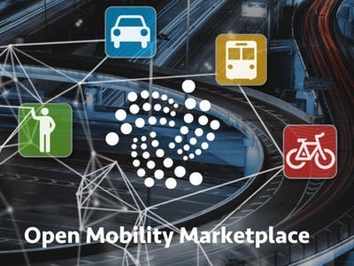
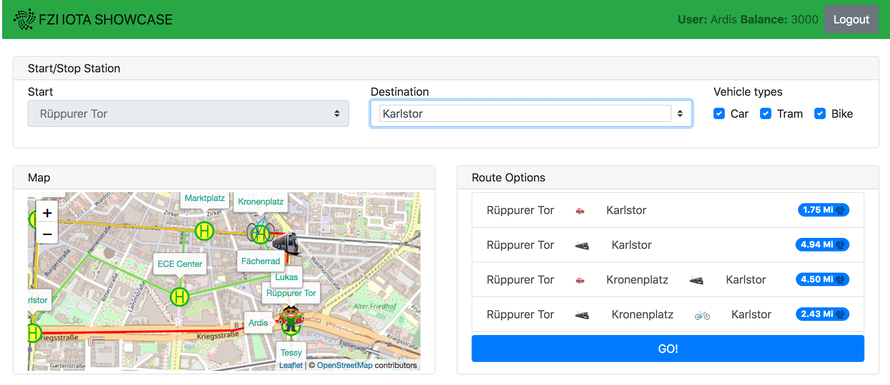
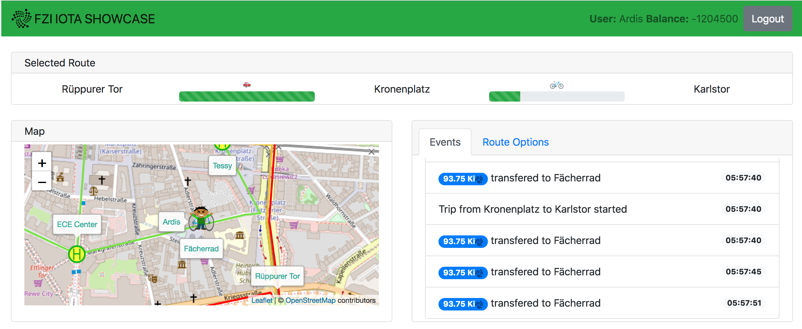
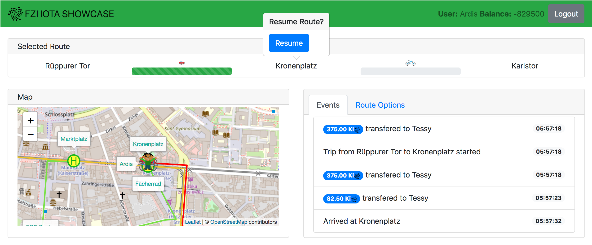
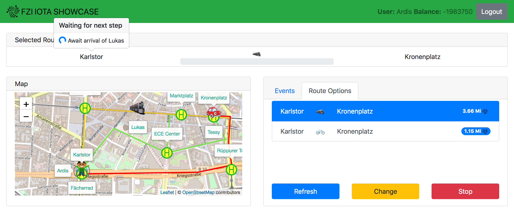

# Welcome to the FZI Iota showcase - Open mobility marketplace

# Requirements

The showcase should show which problems can (only) be solved with IOTA.

Important aspects are:

1. Comprehensibility why DLT is needed
2. The relevance that the showcase uses micro transactions
3. Educational understanding of the IOTA protocol

# Scenario

People use a growing number of different means of transport, such as bicycles, trams or cars, to get from one place to another. Various factors such as time, price or CO2 emissions play a role. More and more often, the means of transport are only borrowed for these connections and no longer belong to the drivers themselves.

However, this is currently still associated with a high organisational effort, as each means of transport must be booked via a different system. Furthermore, the price models are not very flexible, so it is not worthwhile, for example, to travel only a very short distance. In order to make the use of different means of transport attractive and to make transport more efficient, a loan and payment system (ticket system) is needed that is able to invoice the use of different means of transport on a fine granular basis and to manage journeys with different means of transport. The system aims to represent a permissionless marketplace for mobility services which purely runs on a DLT and does not rely on any kind of intermediary.

# Technical problems

A ticket system that realises journeys with different means of transport has the problem that the different providers of means of transport do not trust each other per se, both among themselves and the system itself. In addition, the system must be able to store data about offered means of transport and booked journeys protected from changes and to display them to all participants. It must also be possible to pay for journeys securely so that every provider of a means of transport is correctly remunerated.

# Proposed solution

The permissionless marketplaced run on the iota protokoll is desined by a number of linked MAM and RAAM messaging channels which can replicate all precedures neccessary. The specefication of these can be found in the docs. Both offered means of transport and booked journeys are deposited in the Tangle, where they are unchangeable. Since IOTA does not charge any transaction fees, he journeys can be payed fine-grained, e.g. per meter driven, as microtransactions.

# Setup

A first prototype was implemented for illustration purposes. This is based on a simulated environment in which different mobility participants interact with each other via the tangle.
For example, a participant can inform himself decentrally about available mobility offers and book or pay for them directly.

# Use case

Suppose person A wants to travel in Karlsruhe from the stop Rüppurer Tor to Karlstor. To do this, he asks for all the mobility options on the Tangle and can combine and book them as he wishes. Since selection and payment are fine-grained, the services used or booked can also be changed during the trip. On arrival at the desired destination, all 'formalities' and payments have already been made and you can simply leave the means of transport. The functionality of the protoypical implementation is illustrated in the screenshot.

[showcase description](showcase.md)
