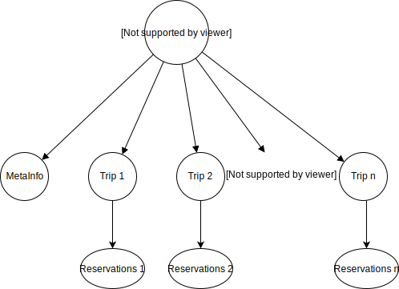

# Seed Management
## The Problem
Any vehicle should be able to create its vehicle channel and all its subchannels using only one seed. That means that the seed for all subchannels must be generated from this one seed. Because a seed is used to sign n (RAAM) or even infinite (MAM) messages, you can't use the same seed for two channels because keys can't be used twice. This results in a dependency between all seeds:



The problem gets more difficult because of the way IOTA (MAM, RAAM) generates keys from a seed:

<code>
subseed(seed, index) = hash(seed + index)
</code>

<code>
key(subseed) = hash(subseed)
</code>

<code>
digest(key) = hash<sup>27</sup>(key) = hash<sup>27</sup>(hash(hash(seed + index)))
</code>

'key' acts as the private and 'digests' as the public key. Due to the one-time-nature of IOTAs signing scheme a signature reveals information to possibly forge signatures which will be successfully verified by the same public key.

That's why a seed of a subchannel can't be created by using some form of `hash(seed + index)`. Then the signature from key i generated from the master seed would reveal information to forge a signature generated by message i using the so created subseed.

## A solution
The solution is to use some sort of mapping for a seed that isn't the plain hash-function used by IOTA. However, this mapping function must have the one-way-property (like a hash-function) so that a revealed subseed can't be used to retrieve the seed. 

Furthermore this mapping must produce different outputs for different indexes used with the same seed (some sort of collision resistance):
`map(seed, i) != map(seed, j) for i != j`

### The 'explode' function
The explode function is an attempt to realize a simple solution for this problem. It does so by generating a string of trytes that is longer than the given seed + index, hence the name explode and feeding this into the hash-function which provides the one-way-property and collision resistance.

The problem thereby gets reduced to `exploding(seed, i) != exploding(seed, j), for all i, j from N` and `exploding(seed, i) != seed + f(i), for all i from N and f(i) from N`

More precisly exploding uses seed + index as a trits input and splitting it into 3 equally long parts. Then the parts get put together in 3 differnt orders and fed into the hashfunction: 
```js
hash.absorb(parts[0] || parts[2] || parts[1])
hash.absorb(parts[1] || parts[0] || parts[2])
hash.absorb(parts[2] || parts[1] || parts[0])
```
The order is is reversed from the original order in the seed so that the hash-function never gets fed the original seed. The output is then: `hash.squeeze()`. 

This produce a 243 trit string or 81 tryte string which is the required length of seeds. This output can be used to create subchannels which keys don't collide with the ones from the master channel.
